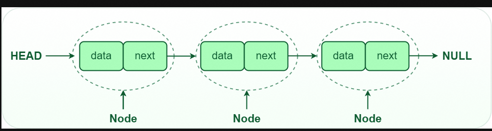
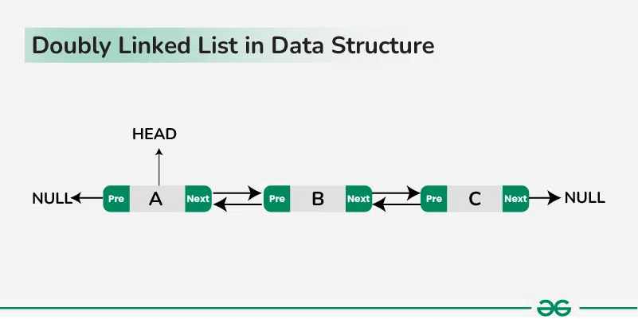

链表vs数组
- 数组(Array)的特点:

内存连续: 在内存中，数组是一段连续的内存区域，这意味着元素可以通过索引快速访问。访问任意索引下值的时间复杂度为O(1)。

大小固定: 在一些底层语言中（如C/C++），数组在声明时需要指定大小。在JavaScript中，数组可以动态增长，但在背后可能涉及重新分配和复制整个数组的操作，这可能会影响性能。

插入和删除成本高: 由于数组的内存连续性，插入或删除元素（特别是在数组的起始位置）可能需要移动元素以维护数组的连续性，因此在最坏情况下的时间复杂度为O(n)。

- 链表(LinkedList)的特点:

内存非连续: 链表由一系列节点构成，每个节点包含数据和指向下一个节点的指针。节点在内存中不要求连续，可以分散存放。

动态大小: 链表可以灵活地增长和缩减大小，不需要预先声明大小，每次插入或删除只涉及到改变指针指向，时间复杂度为O(1)。

访问成本高: 访问链表中的元素需要从头节点遍历链表直到找到所需节点，时间复杂度为O(n)；不像数组那样可以直接通过索引快速访问。

# 单向链表

# 双向链表

- 单向链表(Singly Linked List)：

撤销/重做操作：单向链表可以用作维护应用状态的历史记录的栈，在文本编辑器或图像编辑器中实现撤销（undo）功能。
动态内容列表：当一个动态的列表或集合需要经常插入和删除元素时，单向链表可以用来简化操作，因为添加或移除项不需要重新索引其他元素，如新闻feed列表加载更多内容时。
队列实现：单向链表可以用来实现队列数据结构，适用于需要先进先出操作的场景，例如异步任务队列。
- 双向链表(Doubly Linked List)：

双向遍历：当你需要从任一方向遍历元素，例如创建一个可以向前或向后翻页的幻灯片展示应用时。
数据项的快速插入和删除：如果需要在列表中间进行频繁的插入和删除操作，双向链表可以提供比单向链表更高效的操作，因为可直接访问前驱节点。
浏览器的前进和后退导航：双向链表可以模拟网页浏览的前进和后退栈。
- 循环链表(Circular Linked List)：

循环队列：用于实现类似于轮转调度（Round-Robin Scheduling）的算法，它可以模拟一个首尾相连的循环队列，适用于管理固定资源的分配。
持续播放列表：可以应用在音乐播放器、幻灯片展示或任何需要循环访问元素的场景，循环链表可以让你在最后一个元素后直接跳转回第一个元素。
